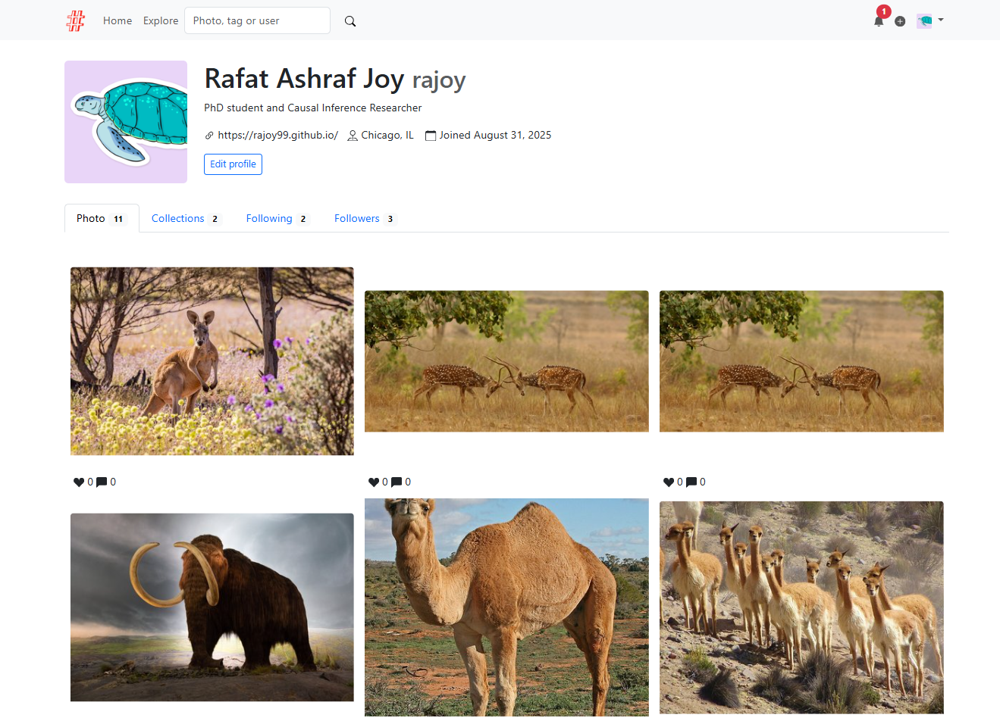

# Moments_clone





### Installation

Clone the repo:

```
$ git clone https://github.com/rajoy99/moments_clone
$ cd moments
```
Install dependencies with [PDM](https://pdm.fming.dev):

```
$ pdm install
```

> [!TIP]
> If you don't have PDM installed, you can create a virtual environment with `venv` and install dependencies with `pip install -r requirements.txt`.

---
To automatically generate descriptions and tags, you’ll need your **Microsoft Azure API Key** and **Endpoint**. Follow these steps to set them up:
### 1. Connect to the Azure Vision API

1. Sign up for a Microsoft Azure student account: [Azure for Students](https://azure.microsoft.com/en-us/free/students/)  
   - No credit card required (for educational institutions only; others will need a paid subscription).  
2. Create a **Computer Vision** service instance and copy its **API endpoint**.  
3. Generate a **subscription key** to authorize your script to call the Computer Vision API.  

---

### 2. Store Your Credentials in a `.env` File

Add the following lines to your `.env` file:

```env
Endpoint="Your API Endpoint"
Key="Your API Key"

```
---

To initialize the app, run the `flask init-app` command:

```
$ pdm run flask init-app
```

If you just want to try it out, generate fake data with `flask lorem` command then run the app:

```
$ pdm run flask lorem
```

It will create a test account:

* email: `admin@helloflask.com`
* password: `moments`

Now you can run the app:

```
$ pdm run flask run
* Running on http://127.0.0.1:5000/
```

## License

This project is licensed under the MIT License (see the
[LICENSE](LICENSE) file for details).
